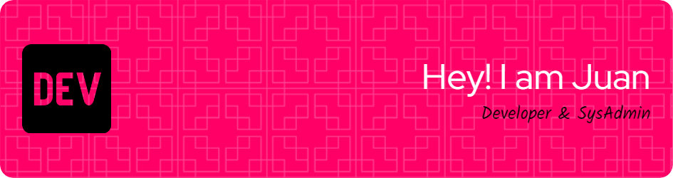

# Exceed Yourself and Never Give Up 

## Me llamo Juan, soy programador y administrador de sistemas

<ul>
  <li>Soy un entusiasta de la programación y un apasionado de la tecnología</li>
  <li>Me encanta programar</li>
  <li>Curioso y con una gran motivación</li>
  <li>Me gustan los retos</li>
</ul>

 > No fracasé, solo descubrí 999 maneras de como no hacer una bombilla - Thomas Alva Edison

### Aquí compartiré mis proyectos, retos, curiosidades del mundo de la tecnología e intentaré aportar mis conocimientos a la comunidad OpenSource

## TECNOLOGÍAS 🖥️📂

